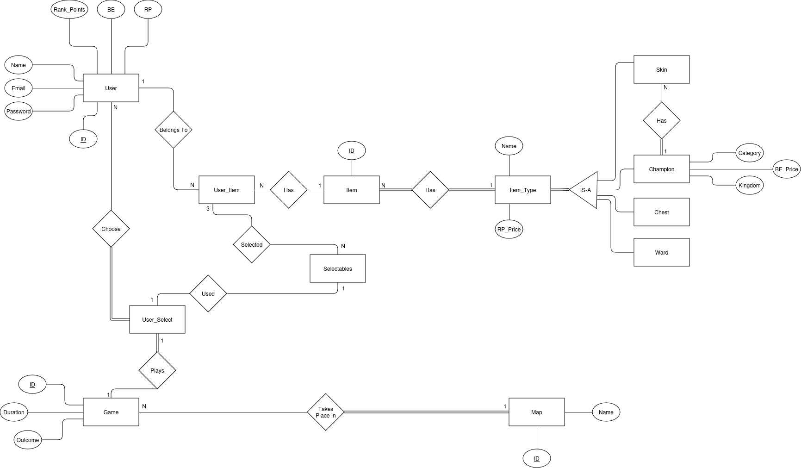
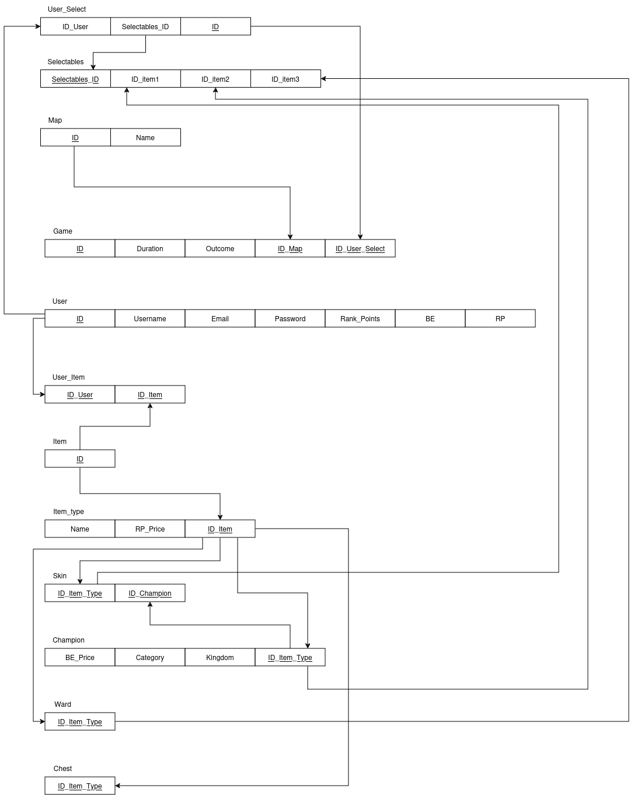

# BD: Trabalho Prático APFE

**Grupo**: P11G1
- Martim Santos, MEC: 114614
- Rui Machado, MEC: 113765

## Introdução / Introduction
 
- O objetivo deste projeto é criar uma base de dados sobre o jogo league of legends. A qual onde o jogador consegue executar várias tarefas através da interface que irá ser desenvolvida de modo a perceber mais ao menos o funcionamento do jogo.

## ​Análise de Requisitos / Requirements
- O utilizador teria de ser capaz de criar uma conta.
- O utilizador teria de ser capaz de simular uma compra de um item na loja do client.
- O utilizador teria de ser capaz de simular um jogo, com uma escolha de itens feita anteriormente.
- O utilizador teria de ser capaz de abrir um chest que é um item que permite ao utilizador ganhar recompensas.
- O utilizador teria de ser capaz de aumentar o seu rank através da simulação de partidas.

## DER

## ER

