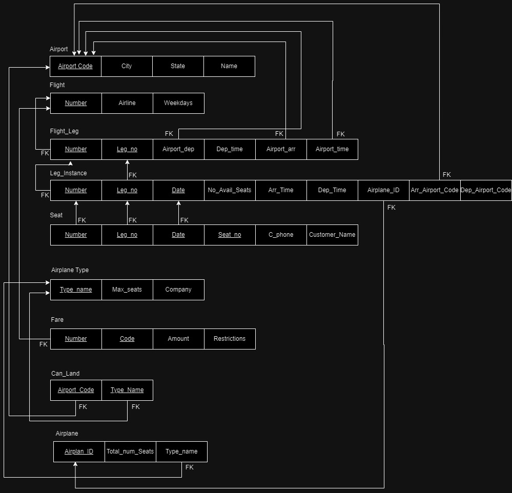
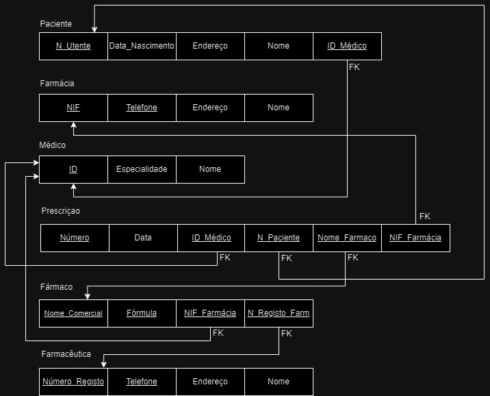
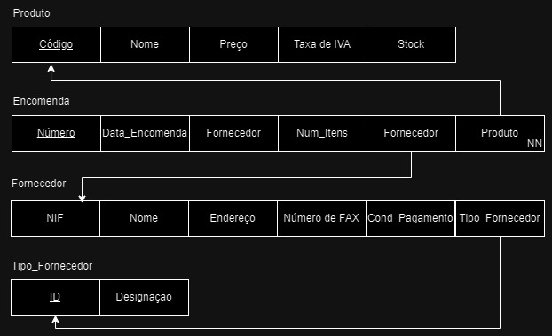
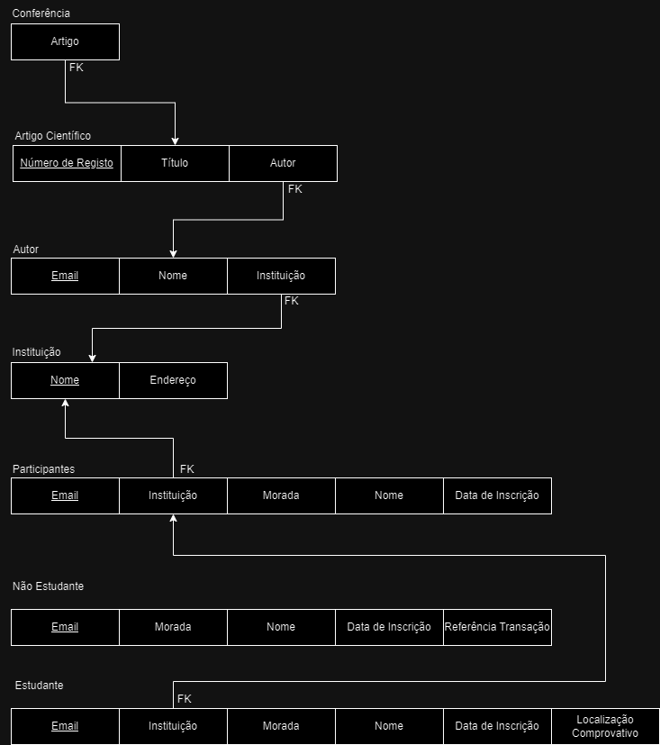

# BD: Guião 3


## ​Problema 3.1
 
### *a)*
#### Relações
```
-> Cliente(Nome, Endereço, Num_carta, Nif)
-> Aluguer(Número, Duração, Data)
-> Balcão(Número, Nome, Endereço)
-> Veículo(Matrícula, Ano, Marca)
-> Tipo_Veiculo(Código, Designação, ArCondicionado)
-> Ligeiro(NumLugares, Portas, Combustivel)
-> Pesado(Peso, Passageiros)
```


### *b)* 
#### Chaves Primárias
```
-> Cliente(Nif)
-> Aluguer(Número)
-> Balcão(Número)
-> Veículo(Matrícula)
-> Tipo_Veiculo(Código)
-> Ligeiro(Código)
-> Pesado(Código)
-> Similaridade(Similar1, Similar2)
```
#### Chaves Candidatas
```
-> Cliente(Nif, Num_Carta)
-> Aluguer(Número)
-> Balcão(Número)
-> Veículo(Matrícula)
-> Tipo_Veiculo(Código)
-> Ligeiro(Código)
-> Pesado(Código)
-> Similaridade(Similar1, Similar2)
```
#### Chaves Estrangeiras
```
-> Cliente(Não tem)
-> Aluguer(Cliente, Balcão, Veículo)
-> Balcão(Não tem)
-> Veículo(Tipo_Veiculo)
-> Tipo_Veiculo(Não tem)
-> Similaridade(Similar1, Simalar2)
-> Ligeiro(Código)
-> Pesado(Código)
...
```

### *c)* 


## ​Problema 3.2

### *a)*
#### Relações
```
-> Airport(Airport Code, City, State, Name)
-> Flight(Number, Airline, Weekdays)
-> Flight_Leg(Number, Leg_no, Airport_dep, Dep_time, Airport_arr, Airport_time)
-> Leg_Instance(Number, Leg_no, Date, No_Avail_Seats, Arr_Time, Dep_Time, Airplane_ID, Arr_Airport_Code, Dep_Airport_Code)
-> Seat(Number, Leg_no, Date, Seat_no, C_phone, Customer_Name)
-> Airplane_Type(Type_name, Max_seats, Company)
-> Fare(Number, Code, Amount, Restrictions)
-> Can_Land(Airport_Code, Type_Name)
-> Airplane(Airplane_ID, Total_num_Seats, Type_name)
```


### *b)* 

#### Chaves Primárias
```
-> Airport(Airport_Code)
-> Flight(Number)
-> Flight_Leg(Leg_no, Number)
-> Leg_Instance(Leg_no, Number)
-> Seat(Number)
-> Airplane_Type(Type_Name)
-> Fare(Number, Code)
-> Can_Land(Airport_Code)
-> Airplane(Airplane_ID)
```
#### Chaves Candidatas
```
-> Airport(Airport_Code)
-> Flight(Number)
-> Flight_Leg(Leg_no, Number)
-> Leg_Instance(Leg_no, Number, Date)
-> Seat(Number)
-> Airplane_Type(Type_Name)
-> Fare(Number, Code)
-> Can_Land(Airport_Code, Type_Name)
-> Airplane(Airplane_ID)
```


#### Chaves Estrangeiras
```
-> Airport(Não tem)
-> Flight(Não tem)
-> Flight_Leg(Number, Airport_dep, Airport_arr, Airport _time)
-> Leg_Instance(Number, Leg_no, Arr_Airport_Code)
-> Seat(Number, Leg_no, Date)
-> Airplane_Type(Não tem)
-> Fare(Number)
-> Can_Land(Airport_Code, Type_Name)
-> Airplane(Type_Name)
```


### *c)* 




## ​Problema 3.3


### *a)* 2.1



### *b)* 2.2



### *c)* 2.3



### *d)* 2.4

