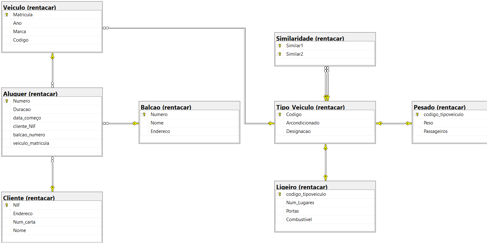
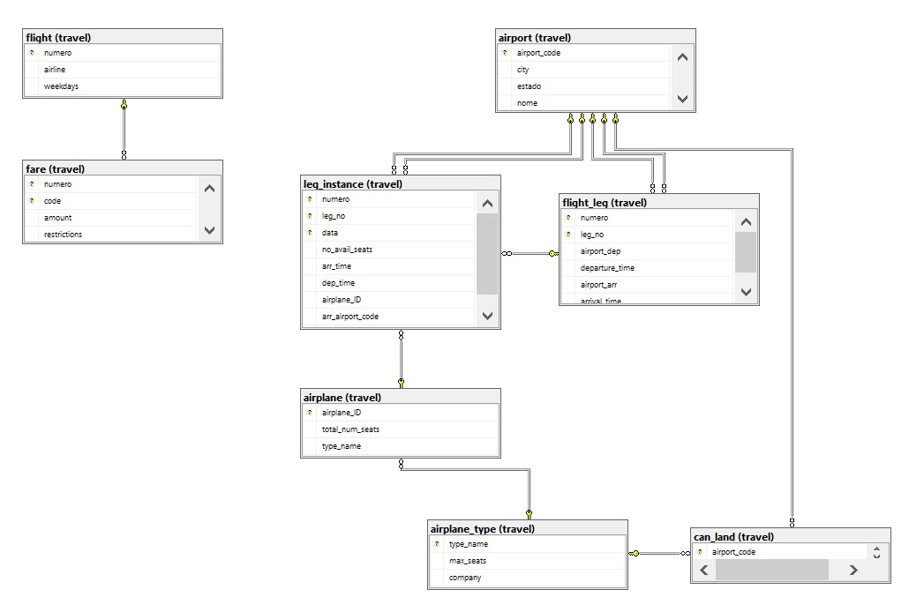
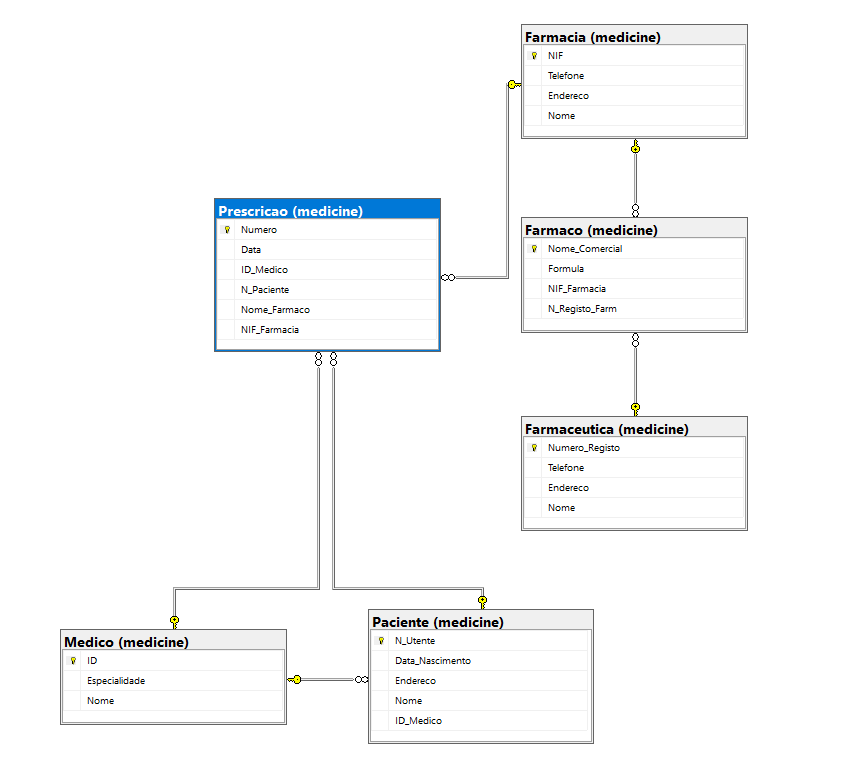
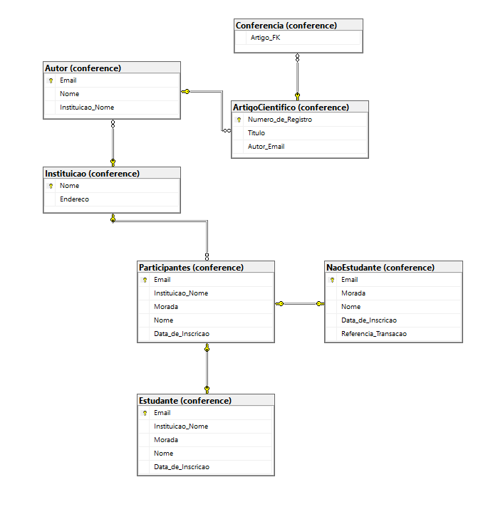
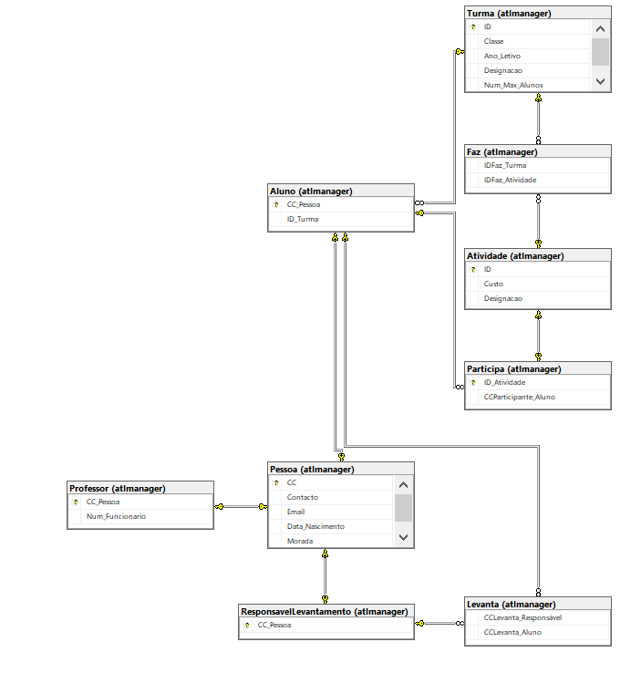

# BD: Guião 4

## ​Problema 4.1

### 1. Sistema de Gestão de um Rent-a-Car

[SQL DDL File](rentacar.sql "SQLFileQuestion")

### 2. Sistema de Gestão de Reservas de Voos

[SQL DDL File](travel.sql "SQLFileQuestion")

### 3. Sistema de Gestão de Stocks – Módulo de Encomendas

[SQL DDL File](stockmanager.sql "SQLFileQuestion")

### 4. Sistema de Prescrição Eletrónica de Medicamentos 

[SQL DDL File](medicine.sql "SQLFileQuestion")

### 5. Sistema de Gestão de Conferências

[SQL DDL File](conference.sql "SQLFileQuestion")

### 6. Sistema de Gestão de ATL

[SQL DDL File](atlmanager.sql "SQLFileQuestion")

